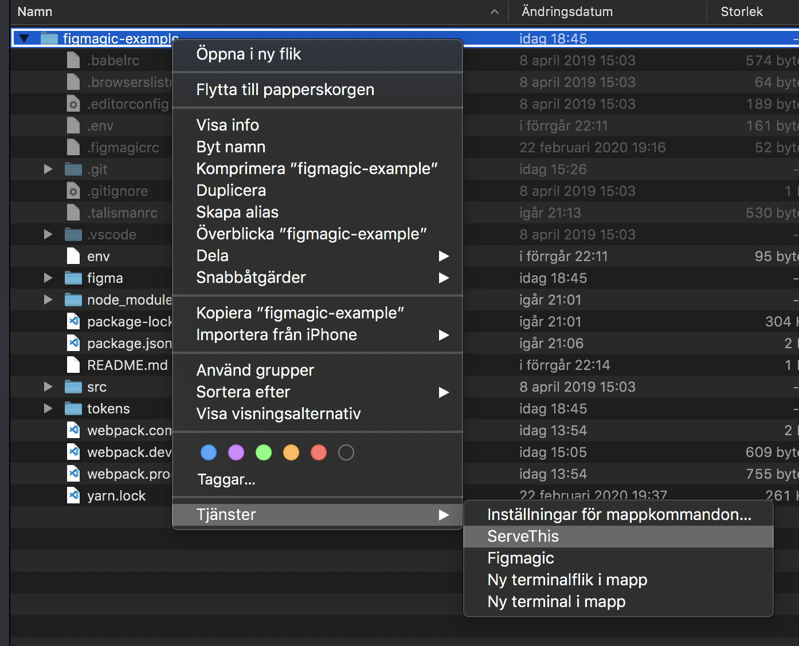
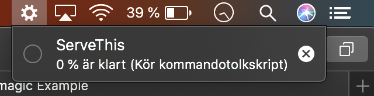
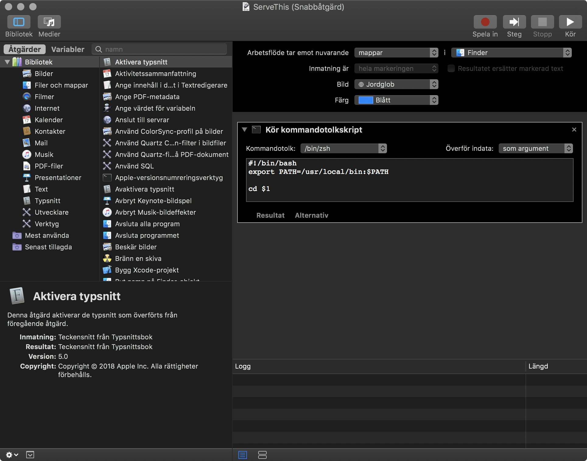

# ServeThis: A Mac OS X Automator service that fires up your Node web server

Sometimes you just need the tiniest, simplest thing. Like a web server. But even getting to start them tends to be a bloated experience, and as a layman maybe you don't want to run a ton of scripts or installs or anything. Or you just get really intimidated by those things. Either way is fine!

If your code runs a Node server that can be started in the common `npm start` way, ServeThis has you covered. ServeThis will also always install any NPM dependencies you might have. Don't know what that means? Even better! "It just works", then.

## Prerequisites

- You are running a Mac OS X system
- The service expects that the folder you provide it with contains a Node project
- The service expects you to have NPM/Node installed
- The service expects you to have a script in your `package.json` called `start`

## Installation

- Double click the workflow file, `ServeThis.workflow`, to install it

## Using it

- Right click a folder, and you should see `ServeThis` under the Services category

_Usage demonstration_

- Depending on project behavior, you should see your default web browser open up in a few seconds, with the URL to whatever the application is serving
- To shut down the webserver, click the gear in the upper right corner and then the small "X" icon

_Shutting down the webserver_

## Source code

The tiny script that gets run is available under `ServeThis.sh`.

## Automator configuration

_How the service is configured in Automator_
